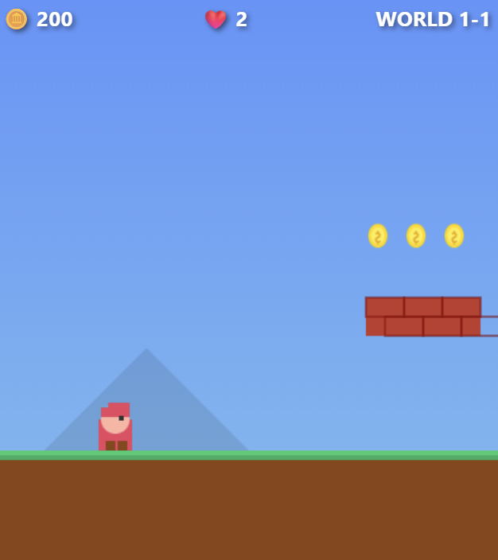

# 🎮 一行もコードを書かずに GitHub Copilot でレトロ風ゲームをデプロイしてみた

> すべてのコード生成・環境構築・デプロイ作業を GitHub Copilot（Claude Opus 4.6）が実行しました。  
> 人間が書いたコードは **0行** です。

**スマホでもPCでも遊べます。皆さんも良ければぜひ遊んでみてください！**

👉 **https://yellow-stone-0c8825500.6.azurestaticapps.net**



## 📖 概要

VS Code の GitHub Copilot Agent Mode を活用し、モバイル対応のレトロ風2Dプラットフォームゲームをゼロから開発し、Azure Static Web Apps にデプロイするまでの全工程を AI に任せました。

自分が行ったのは、「こういうゲームを作りたい」「ここを修正してほしい」「デプロイしたい」といったプロンプトの入力のみです。

## 🎯 完成したゲームの特徴

- **3つのステージ + ボス戦**: 地上 → 地下 → 空中 → ボス戦
- **二段ジャンプ**: 空中でもう一度ジャンプ可能
- **タッチ操作対応**: モバイルブラウザでプレイ可能（仮想十字キー＋ジャンプボタン）
- **キーボード操作**: 矢印キー / WASD + スペースキー
- **コイン収集 & スコアシステム**
- **敵キャラクター**: オリジナルの画像を敵スプライトとして使用
- **ボス戦**: 敵キャラの1.5倍サイズのボスが登場、HPバー付き、3回踏んで撃破
- **パーティクルエフェクト**: ジャンプ・コイン取得・敵撃破時の演出
- **ステージクリア演出**: 旗に触れるとクリア

## 🛠️ 開発プロセス

GitHub Copilot に以下の指示を出し、対話的に開発を進めました。

### Step 1: ゲームの基本構造を作成

**プロンプト:** 「モバイルのWebアプリで動くレトロ風ゲームを開発したい」

このプロンプトひとつで、Copilot が以下の3ファイルを生成しました：
- `index.html` — ゲーム画面・タイトル画面・ゲームオーバー画面の HTML 構造
- `style.css` — モバイル対応のレスポンシブ CSS（safe-area-inset 対応）
- `game.js` — 約1,200行のゲームエンジン（物理演算・衝突判定・3ステージ・敵AI）

### Step 2: ゲーム機能の追加

**プロンプト:** 「二段ジャンプを実装してください」「キャラのスピードは一定にしてください」

- Player クラスに `maxJumps` / `jumpCount` を追加し二段ジャンプを実装
- 加速度・摩擦ベースの移動を一定速度の移動に変更

### Step 3: 敵キャラクターの変更

**プロンプト:** 「敵キャラを添付の画像のキャラクターに変更してください」

- 添付した画像（`enemy.png`）を敵スプライトとして設定
- 画像が読み込めない場合の Canvas 描画フォールバックも実装

### Step 4: タイトル画面・バグ修正・ボス戦追加

**プロンプト:** 「タイトルを可愛くして」「速度バグを直して」「レンガのはみ出しを直して」「ボス戦を追加して」

- タイトル画面に地球キャラ画像をバウンスアニメーション付きで配置
- 死亡後の移動速度が加速するバグを修正
- レンガブロックの描画が右にはみ出す問題をクリッピングで修正
- WORLD 1-3 クリア後にボス戦ステージを追加（HP3。1.5倍サイズのボス）

### Step 5: GitHub リポジトリの作成

**プロンプト:**（Copilot が自動で実行）

```
git init → git add → git commit
gh repo create pcmn1000/retro-game --public
git push
```

リポジトリの作成から push まで、Copilot が一連の流れで実行してくれました。

### Step 6: Azure Static Web Apps へデプロイ

**プロンプト:** 「本格的に公開したい。Azureのサブスクリプションを保有しています」

Copilot が Azure CLI を使って以下を実行：
1. `az group create` — リソースグループ `retro-game-rg` を East Asia に作成
2. `az staticwebapp create` — Azure Static Web Apps（Free プラン）を作成し GitHub リポジトリと連携
3. GitHub Actions ワークフローが自動生成され、`main` ブランチへの push で自動デプロイ

人間が行ったのは、Azure ログイン時のシングルサインオン（SSO）でアカウントを選択したのみです。

## 📁 ファイル構成

```
retro-game/
├── index.html          # ゲーム UI（HTML）
├── style.css           # スタイル（CSS）
├── game.js             # ゲームエンジン（JavaScript, ~1,450行）
├── enemy.png           # 敵キャラクター画像
├── screenshots/        # スクリーンショット
├── server.ps1          # ローカル開発用サーバー（PowerShell）
├── README.md           # このファイル
└── .github/
    └── workflows/
        └── azure-static-web-apps-*.yml  # 自動デプロイ用 GitHub Actions
```

## 🏗️ 技術スタック

| カテゴリ | 技術 |
|---------|------|
| フロントエンド | HTML5 Canvas, Vanilla JavaScript, CSS3 |
| ホスティング | Azure Static Web Apps（Free プラン） |
| CI/CD | GitHub Actions（Azure 自動生成） |
| ソース管理 | GitHub |
| 開発ツール | VS Code + GitHub Copilot（Claude Opus 4.6） |
| 人間の貢献 | プロンプト入力、Azure SSO 認証 |

## 🤝 Azure CLI × GitHub Copilot の相性

今回のデプロイで特に印象的だったのは、**Azure CLI と GitHub Copilot の相性の良さ**です。

Azure CLI はすべての操作をコマンドラインで完結できるため、Copilot の Agent Mode との親和性が非常に高いと感じました。リソースグループの作成、Static Web Apps のプロビジョニング、GitHub リポジトリとの連携まで、すべて Copilot がターミナル上で `az` コマンドを組み立てて実行してくれます。

GUI の Azure Portal では人間がクリック操作を行う必要がありますが、CLI ベースであれば Copilot に「Azure にデプロイして」と指示するだけで、適切なコマンドの選択・実行を任せることができます。

**「Azure にデプロイ」という自然言語が、そのまま `az` コマンドに変換されて実行される**——この体験は、CLI ベースのツール設計が AI との連携において大きな強みを持つことを実感させてくれました。

## 💡 学んだこと

- GitHub Copilot の Agent Mode を使えば、ゲーム開発からクラウドデプロイまで **コードを一行も書かずに** 完結できる
- Azure Static Web Apps の Free プランなら **100GB/月の帯域** まで無料で公開可能
- GitHub 連携により、コードを push するだけで自動デプロイされる
- **Azure CLI × GitHub Copilot の相性は非常に良い**。自然言語 → CLI コマンドの変換がシームレス

## 📝 ライセンス

MIT
